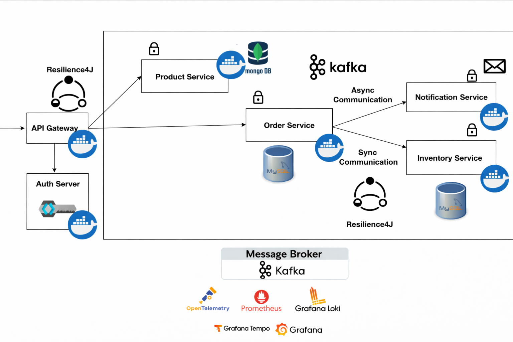

# Ecommerce Microservices Backend

A production-style **Spring Boot microservices backend** for an ecommerce platform.  
The system is designed using **domain-driven service boundaries**, **event-driven communication**, **centralized authentication**, **fault tolerance**, and **observability**, all runnable in a **local development environment**.

---

## Project Structure

```
ecommerce-microservices
│
├── api-gateway
├── product-service
├── order-service
├── inventory-service
├── notification-service
│
├── docs
│   └── architecture.png
│
├── postman
│   └── E-commerce Microservice.postman_collection.json
│
├── pom.xml                # Parent Maven POM (multi-module)
└── README.md
```

Each service is an **independent Spring Boot application** with its own Maven build, Docker configuration, database, and runtime lifecycle.

---

## Services Overview

### API Gateway
- Built using **Spring Cloud Gateway (MVC)**
- Single entry point for all client requests
- Integrates with **Keycloak** for authentication
- Applies **Resilience4j circuit breakers** for fault tolerance
- Routes traffic to downstream services

### Product Service
- Manages product catalog and pricing
- Uses **MongoDB**
- Exposes REST APIs with **OpenAPI / Swagger documentation**

### Order Service
- Handles order creation and lifecycle
- Uses **MySQL**
- Publishes order events to **Kafka**
- Protected with **Resilience4j circuit breakers**
- APIs documented using **OpenAPI / Swagger**

### Inventory Service
- Manages stock availability
- Uses **MySQL**
- APIs documented using **OpenAPI / Swagger**

### Notification Service
- Listens to Kafka events
- Sends asynchronous notifications
- Decoupled from core business flow

---

## Tech Stack

**Backend**
- Java 21
- Spring Boot
- Spring Cloud Gateway (MVC)

**Data Stores**
- MongoDB (Product Service)
- MySQL (Order & Inventory Services)

**Messaging**
- Apache Kafka

**Security**
- Keycloak (OAuth2 / OpenID Connect)

**Resilience & Stability**
- Resilience4j (Circuit Breakers, Retry, Timeout)

**API Documentation**
- OpenAPI / Swagger

**Testing**
- JUnit 5
- Testcontainers
- WireMock

**Observability**
- Prometheus
- Grafana
- Loki
- Tempo

**Containerization**
- Docker
- Docker Compose (per service)

---

## Architecture Overview



---

## Prerequisites

- Java 21
- Docker & Docker Compose
- Apache Kafka
- MongoDB
- MySQL
- Keycloak

---

## Build the Project

This is a **multi-module Maven project**.

```bash
mvn clean install
```

To build an individual service:

```bash
cd product-service
mvn clean package
```

Repeat the same steps for other services.

---

## Running the Application (Local)

### 1. Start Infrastructure

Each service contains its own `docker-compose.yml` for required dependencies.

Example:

```bash
cd order-service
docker-compose up -d
```

This starts required components such as databases, Kafka (where applicable), and supporting volumes.

---

### 2. Start Services

Run services individually:

```bash
mvn spring-boot:run
```

Recommended startup order:

1. Inventory Service  
2. Product Service  
3. Order Service  
4. Notification Service  
5. API Gateway  

---

## API Documentation (Swagger)

Each service exposes OpenAPI documentation.

Example (via API Gateway):

```
http://localhost:9000/swagger-ui.html
```

---

## Postman Collection

A ready-to-use Postman collection is provided to test all APIs exposed by the system.

### Location

```
postman/E-commerce Microservice.postman_collection.json
```

### Import Instructions

1. Open **Postman**
2. Click **Import**
3. Select the collection file from the `postman` folder
4. Import the collection

### Included Requests

The collection contains example requests for:
- Product Service (create product, get products)
- Order Service (create order)
- Inventory Service (check stock availability)
- Actuator endpoints (health & circuit breaker status)

### Base URL

All requests are routed through the **API Gateway**.

```
http://localhost:9000
```

### Authentication

The Postman collection is preconfigured with **OAuth2 Client Credentials flow** using **Keycloak**.

- Token URL:
  ```
  http://localhost:8181/realms/spring-microservices-security-realm/protocol/openid-connect/token
  ```
- Client ID:
  ```
  spring-client-credentials-id
  ```

Postman automatically fetches and attaches the access token to requests.

---

## Observability & Monitoring

- Spring Boot Actuator exposes application metrics
- Prometheus scrapes metrics
- Grafana visualizes dashboards
- Loki & Tempo provide centralized logging and distributed tracing

---

## Testing

Run tests for any service:

```bash
mvn test
```

---

## Key Engineering Highlights

- Microservices with clear domain ownership
- Database-per-service architecture
- Event-driven communication using Kafka
- Centralized authentication with Keycloak
- Circuit breakers using Resilience4j
- OpenAPI / Swagger documentation
- Observability-first design
- Dockerized local development
- Multi-module Maven project

---

## Author

**Nikhil Tiwari**
